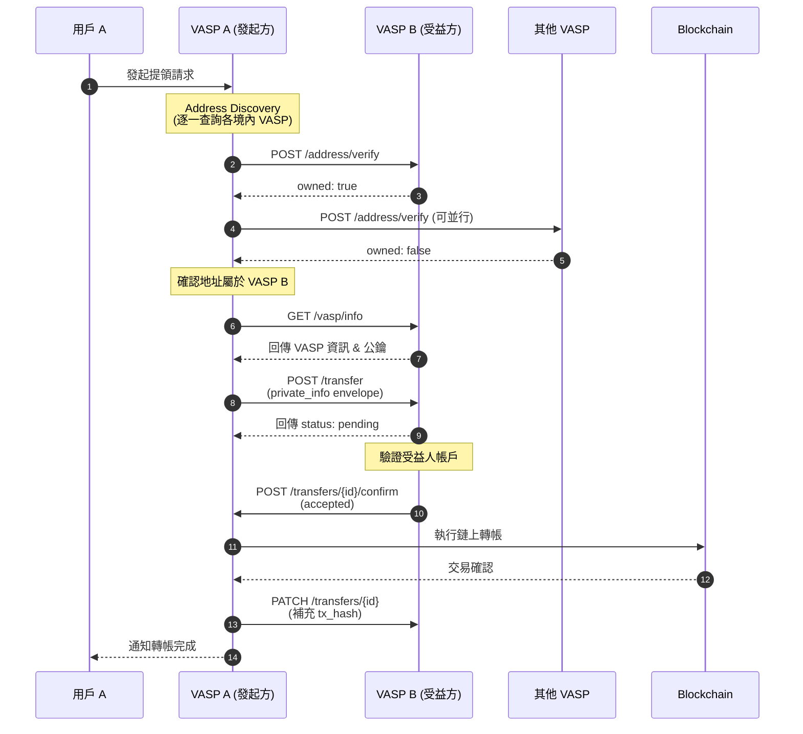
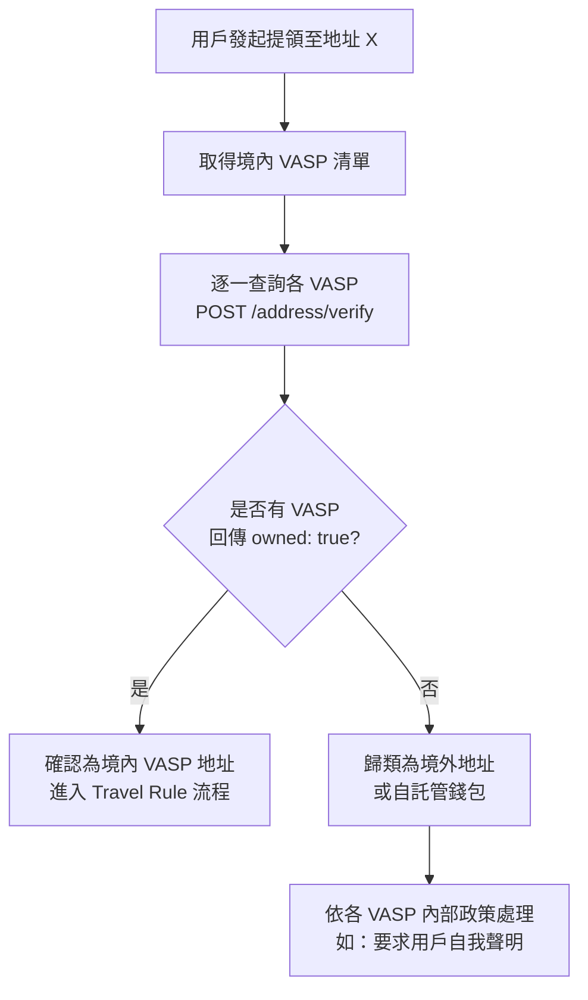

<Note>
**[v2.0 變更]** 第一階段不設立中央 VASP Registry。Address Discovery 採用分散式做法：發起方 VASP 直接逐一查詢境內各 VASP，若所有查詢結果皆為否定，則將該地址歸類為境外地址或自託管錢包。
</Note>

## 完整 Travel Rule 流程（第一階段：無 Registry）

```
┌─────────────────────────────────────────────────────────────────────────┐
│               Travel Rule 完整流程（第一階段：無 Registry）               │
└─────────────────────────────────────────────────────────────────────────┘

User A          VASP A                 VASP B ~ N               Blockchain
  │               │                       │                        │
  │ 1. 發起提領   │                       │                        │
  │──────────────>│                       │                        │
  │               │                       │                        │
  │               │ 2. Address Discovery (逐一查詢各 VASP)          │
  │               │   POST /address/verify                         │
  │               │──────────────────────>│                        │
  │               │                       │                        │
  │               │ 3. 回傳 owned: true   │                        │
  │               │<──────────────────────│ (假設 VASP B 擁有)     │
  │               │                       │                        │
  │               │ 4. GET /vasp/info     │                        │
  │               │──────────────────────>│                        │
  │               │                       │                        │
  │               │ 5. 回傳 VASP 資訊 & 公鑰                      │
  │               │<──────────────────────│                        │
  │               │                       │                        │
  │               │ 6. POST /transfer (private_info envelope)      │
  │               │──────────────────────>│                        │
  │               │                       │                        │
  │               │ 7. 回傳 pending       │                        │
  │               │<──────────────────────│                        │
  │               │                       │  8. 驗證受益人          │
  │               │                       │───────────────>        │
  │               │                       │                        │
  │               │ 9. POST /transfers/{id}/confirm (accepted)     │
  │               │<──────────────────────│                        │
  │               │                       │                        │
  │               │ 10. 執行鏈上轉帳      │                        │
  │               │───────────────────────────────────────────────>│
  │               │                       │                        │
  │               │ 11. PATCH /transfers/{id} (tx_hash)            │
  │               │──────────────────────>│                        │
  │               │                       │                        │
  │ 12. 通知完成  │                       │                        │
  │<──────────────│                       │                        │
  │               │                       │                        │
```

## 時序圖



## Address Discovery 流程（無 Registry）[v2.0 新增]



<Note>
各 VASP 需自行維護一份境內 VASP 的端點清單（Base URL）。在第一階段，此清單可透過公會秘書處統一維護與分發。後續版本可考慮建立中央 Registry 機制。
</Note>
