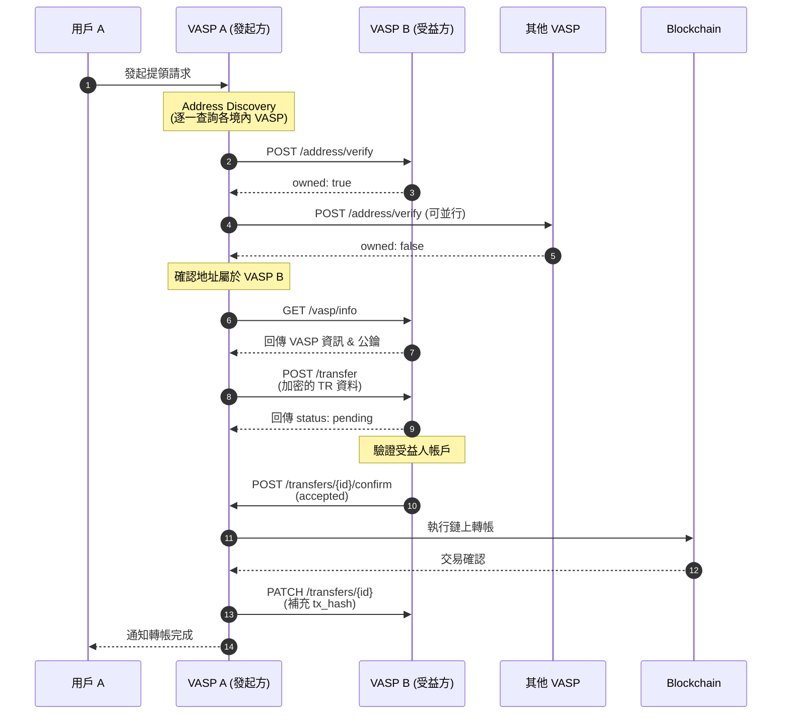
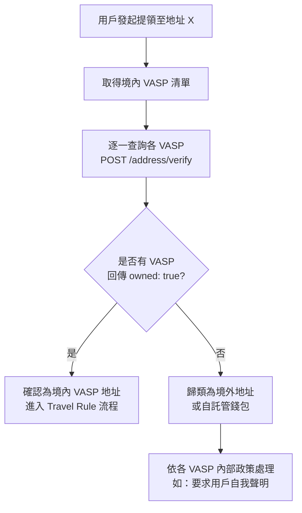

# domestic-travel-rule-api-spec

## 目錄

1. [概述](#1-概述)
2. [認證與安全](#2-認證與安全)
3. [API Endpoints](#3-api-endpoints)
4. [資料模型](#4-資料模型)
5. [錯誤處理](#5-錯誤處理)
6. [流程範例](#6-流程範例)
7. [附錄](#7-附錄)

## 1. 概述

### 1.1 目的

本文件定義境內虛擬資產服務提供商（VASP）之間實作 Travel Rule 所需的 API 規格，使各 VASP 能夠：

- 查詢目標地址是否屬於境內 VASP
- 交換交易相關的發起人/受益人資訊
- 確認或拒絕交易資料

### 1.2 適用範圍

- 境內 VASP 對境內 VASP 的虛擬資產轉帳
- 達到 Travel Rule 門檻的交易（依主管機關規定）

### 1.3 版本資訊

| 版本 | 日期 | 說明 |
|------|------|------|
| 1.0 | 2024-01-21 | 初版 |
| 2.0 | 2025-02-11 | 加入 Nonce 防重放機制、公鑰過期時間、Memo/Tag 支援、移除 Registry 依賴 |
| 2.1 | 2026-03-26 | 第三次技術會議：physical_address 結構化、date_of_birth 格式放寬、identification type 擴充、Rate Limit 定案、config versioning |

### 1.4 術語定義

| 術語 | 說明 |
|------|------|
| Originator | 發起人，發起轉帳的用戶 |
| Beneficiary | 受益人，接收轉帳的用戶 |
| Originating VASP | 發起方 VASP，處理發起人轉帳請求的交易所 |
| Beneficiary VASP | 受益方 VASP，受益人所屬的交易所 |
| Transfer | 一筆需要交換 Travel Rule 資料的轉帳 |

## 2. 認證與安全

### 2.1 傳輸層安全

- **強制使用 HTTPS**（TLS 1.2 以上）
- **僅允許各業者提供之白名單 IP 呼叫**

### 2.2 API 認證

所有 API 請求必須包含以下 Headers：

```
X-VASP-ID: {vasp_id}
X-Timestamp: {ISO8601_timestamp}
X-Signature: {request_signature}
X-Nonce: {unique_random_string_32_chars}
```

> **[v2.0 新增] X-Nonce 防重放攻擊機制**
>
> 每個 API 請求必須包含一個唯一的 32 字元隨機字串作為 Nonce。接收方 VASP 應：
>
> 1. 檢查該 Nonce 是否已被使用過（建議保留至少 24 小時的 Nonce 記錄）
> 2. 若 Nonce 重複，回傳 `409 Conflict` 錯誤（錯誤代碼 `DUPLICATE_NONCE`）
> 3. 將 Nonce 納入簽章計算，確保攻擊者無法竄改 Nonce 值
>
> **威脅情境**：攻擊者可能攔截合法的 `/transfer` 請求，在簽章過期前重複發送相同請求，可能造成重複交易或資料洩漏。Nonce 機制可有效防止此類重放攻擊。

#### 簽章計算方式

```
signature = HMAC-SHA256(
  key: shared_secret,
  message: "{method}\n{path}\n{timestamp}\n{nonce}\n{body_hash}"
)
body_hash = SHA256(request_body)
```

> **[v2.0 變更]** 簽章計算中新增 `{nonce}` 欄位，確保 Nonce 與簽章綁定，防止攻擊者替換 Nonce 後重送請求。

### 2.3 敏感資料加密

發起人/受益人的個人資訊（PII）應使用接收方 VASP 的公鑰進行加密：

- **加密演算法**：RSA-OAEP 或 ECIES
- **加密欄位**：originator.name、beneficiary.name 等 PII 欄位

#### 金鑰輪換機制

> **[v2.0 新增] VASP 間金鑰輪換流程**
>
> 在第一階段的分散式架構下（無中央 Registry），各 VASP 透過以下機制管理金鑰輪換：
>
> 1. 每個 VASP 的 `GET /vasp/info` 回應中，`public_keys` 陣列包含公鑰的 `expires_at` 欄位
> 2. 各 VASP 應定期呼叫其他 VASP 的 `GET /vasp/info`，建議頻率不低於金鑰過期時間的一半（例如：金鑰有效期 1 年，則至少每 6 個月查詢一次）
> 3. 當偵測到目標 VASP 的公鑰即將過期（建議提前 30 天），應主動取得新公鑰
> 4. 金鑰輪換期間，VASP 可同時保留新舊公鑰（舊鑰 status 設為 `rotating`，新鑰 status 設為 `active`），確保轉換期間不影響服務
>
> **注意**：此為第一階段簡易做法。後續版本應規劃更完善的金鑰管理機制（如集中式金鑰目錄或憑證機制），避免持續依賴手動傳遞公鑰。

### 2.4 IP 白名單

各 VASP 應維護境內 VASP 的 IP 白名單，僅接受來自已註冊 VASP 的請求。

## 3. API Endpoints

### Base URL

```
https://api.{vasp-domain}/travel-rule/v1
```

### 3.1 VASP 資訊

#### GET /vasp/info

取得該 VASP 的基本資訊與公鑰。

> 各 VASP 應定期呼叫此 API 以取得最新公鑰。呼叫頻率應參考回應中 `public_keys[].expires_at` 欄位，在公鑰過期前主動更新。

**Request Headers**

```
X-VASP-ID: VASP_A
X-Timestamp: 2024-01-21T10:00:00Z
X-Signature: {signature}
X-Nonce: {unique_random_string_32_chars}
```

**Response**

```json
{
  "vasp_id": "VASP_B",
  "legal_name": "某某交易所股份有限公司",
  "display_name": "交易所 B",
  "lei_code": "5493001KJTIIGC8Y1R12",
  "jurisdiction": "TW",
  "registered_services": [
    {
      "service_type": "exchange",
      "registered": true,
      "license_number": "FSC-VASP-2024-001"
    },
    {
      "service_type": "transfer",
      "registered": true,
      "license_number": "FSC-VASP-2024-001"
    },
    {
      "service_type": "custody",
      "registered": true,
      "license_number": "FSC-VASP-2024-001"
    }
  ],
  "supported_assets": [
    {
      "symbol": "BTC",
      "network": "bitcoin"
    },
    {
      "symbol": "ETH",
      "network": "ethereum"
    },
    {
      "symbol": "USDT",
      "network": "ethereum"
    }
  ],
  "public_keys": [
    {
      "kid": "key-2024-001",
      "algorithm": "RSA-2048",
      "key": "-----BEGIN PUBLIC KEY-----\nMIIBIjANBgkq...\n-----END PUBLIC KEY-----",
      "status": "active",
      "created_at": "2024-01-01T00:00:00Z",
      "expires_at": "2025-01-01T00:00:00Z"
    }
  ],
  "endpoints": {
    "address_verify": "https://api.vasp-b.com/travel-rule/v1/address/verify",
    "transfer": "https://api.vasp-b.com/travel-rule/v1/transfer"
  },
  "api_version": "2.1",
  "status": "active",
  "config_version": 3,
  "config_updated_at": "2026-03-26T10:00:00Z"
}
```

**Response Fields**

| 欄位 | 類型 | 必填 | 說明 |
|------|------|------|------|
| vasp_id | string | Y | VASP 唯一識別碼 |
| legal_name | string | Y | 公司登記名稱 |
| display_name | string | Y | 顯示名稱 |
| lei_code | string | N | LEI 代碼（如有） |
| jurisdiction | string | Y | 註冊地（ISO 3166-1 alpha-2） |
| registered_services | array | Y | 註冊業務類型列表（見下表） |
| supported_assets | array | Y | 支援的資產列表 |
| public_keys | array | Y | 用於加密通訊的公鑰列表 **[v2.0 變更：由單一物件改為陣列]** |
| endpoints | object | Y | API 端點 URL |
| api_version | string | Y | 支援的 API 版本 |
| status | string | Y | 狀態：active / maintenance / inactive |
| config_version | integer | Y | **[v2.1 新增]** 設定檔版本號（遞增），用於偵測 VASP 資訊是否有變更 |
| config_updated_at | string | Y | **[v2.1 新增]** 設定檔最後更新時間（ISO 8601） |

**Public Keys 欄位** **[v2.0 新增]**

| 欄位 | 類型 | 必填 | 說明 |
|------|------|------|------|
| kid | string | Y | 金鑰唯一識別碼（Key ID） |
| algorithm | string | Y | 加密演算法（RSA-2048, ECIES 等） |
| key | string | Y | 公鑰內容（PEM 格式） |
| status | string | Y | 金鑰狀態：`active` / `rotating` / `revoked` |
| created_at | string | Y | 金鑰建立時間（ISO 8601） |
| expires_at | string | Y | 金鑰過期時間（ISO 8601） |

> **金鑰狀態說明**：
> - `active`：目前使用中的金鑰，其他 VASP 應使用此金鑰加密
> - `rotating`：即將淘汰的舊金鑰，仍可用於解密但不應再用於加密新訊息
> - `revoked`：已撤銷的金鑰，不可使用

**Registered Services 欄位**

| 欄位 | 類型 | 必填 | 說明 |
|------|------|------|------|
| service_type | string | Y | 業務類型：exchange / transfer / custody |
| registered | boolean | Y | 是否已註冊該業務 |
| license_number | string | N | 許可證字號 |

**Service Types 業務類型說明**

| 類型 | 說明 | Travel Rule 影響 |
|------|------|------|
| exchange | 虛擬資產兌換 | - |
| transfer | 虛擬資產移轉 | 若未註冊，無法接收 Travel Rule 資料交換 |
| custody | 虛擬資產保管 | - |

> **重要**：呼叫方應先檢查目標 VASP 是否已註冊 transfer 業務。若該 VASP 未註冊移轉業務，後續的 /address/verify 與 /transfer API 呼叫將會失敗並回傳 SERVICE_NOT_REGISTERED 錯誤。

### 3.2 地址所有權查詢

#### POST /address/verify

查詢指定地址是否屬於該 VASP。

**Request**

```json
{
  "address": "0x742d35Cc6634C0532925a3b844Bc9e7595f8fE21",
  "network": "ethereum",
  "asset": "ETH",
  "memo": null,
  "request_id": "req_abc123"
}
```

**Request Fields**

| 欄位 | 類型 | 必填 | 說明 |
|------|------|------|------|
| address | string | Y | 要查詢的區塊鏈地址 |
| network | string | Y | 區塊鏈網路（bitcoin, ethereum, tron...） |
| asset | string | N | 資產類型（用於多資產地址） |
| memo | string | N | **[v2.0 新增]** Memo / Destination Tag（適用於 XRP, XLM, ATOM, EOS 等需要 Memo/Tag 的鏈） |
| request_id | string | Y | 請求唯一識別碼（用於冪等性） |

> **[v2.0 新增] 關於 Memo / Destination Tag**
>
> 部分區塊鏈（如 XRP、XLM、ATOM、EOS）使用共用地址搭配 Memo 或 Destination Tag 來區分不同用戶。對於這類鏈，僅查詢地址（address）可能不足以確認受益人身份，必須同時提供 `memo` 欄位。
>
> - 若該鏈不使用 Memo/Tag 機制，此欄位可為 `null` 或省略
> - 受益方 VASP 在驗證地址時，應同時比對 address 與 memo 的組合

**Response - 地址屬於該 VASP**

```json
{
  "request_id": "req_abc123",
  "owned": true,
  "vasp_id": "VASP_B",
  "vasp_name": "交易所 B",
  "address": "0x742d35Cc6634C0532925a3b844Bc9e7595f8fE21",
  "memo": null,
  "verified_at": "2024-01-21T10:00:00Z"
}
```

**Response - 地址不屬於該 VASP**

```json
{
  "request_id": "req_abc123",
  "owned": false,
  "address": "0x742d35Cc6634C0532925a3b844Bc9e7595f8fE21",
  "memo": null,
  "verified_at": "2024-01-21T10:00:00Z"
}
```

**Response Fields**

| 欄位 | 類型 | 必填 | 說明 |
|------|------|------|------|
| request_id | string | Y | 對應請求的識別碼 |
| owned | boolean | Y | 該地址是否屬於此 VASP |
| vasp_id | string | N | VASP 識別碼（owned=true 時） |
| vasp_name | string | N | VASP 名稱（owned=true 時） |
| address | string | Y | 查詢的地址 |
| memo | string | N | **[v2.0 新增]** 對應的 Memo / Destination Tag |
| verified_at | string | Y | 查詢時間（ISO 8601） |

### 3.3 發送 Travel Rule 資料

#### POST /transfer

發起方 VASP 向受益方 VASP 發送 Travel Rule 資料。

**Request**

```json
{
  "transfer_id": "tr_20240121_001",
  "transaction": {
    "tx_hash": null,
    "network": "ethereum",
    "asset": "ETH",
    "amount": "1.5",
    "amount_usd": "3500.00",
    "memo": null,
    "originated_at": "2024-01-21T10:00:00Z"
  },
  "originator": {
    "originator_type": "natural_person",
    "name": "{encrypted}",
    "account_id": "user_12345",
    "address": "0xOriginator...",
    "identification": {
      "type": "national_id",
      "number": "{encrypted}",
      "country": "TW"
    },
    "date_of_birth": "{encrypted}",
    "place_of_birth": "{encrypted}",
    "physical_address": "{encrypted}"
  },
  "beneficiary": {
    "beneficiary_type": "natural_person",
    "name": "{encrypted}",
    "address": "0xBeneficiary...",
    "memo": null,
    "account_id": null
  },
  "originating_vasp": {
    "vasp_id": "VASP_A",
    "legal_name": "某某交易所股份有限公司",
    "lei_code": "5493001KJTIIGC8Y1R17"
  },
  "beneficiary_vasp": {
    "vasp_id": "VASP_B"
  },
  "encryption": {
    "kid": "key-2024-001"
  },
  "callback_url": "https://api.vasp-a.com/travel-rule/v1/callback",
  "expires_at": "2024-01-21T10:30:00Z"
}
```

**Request Fields**

| 欄位 | 類型 | 必填 | 說明 |
|------|------|------|------|
| transfer_id | string | Y | 唯一交易識別碼 |
| transaction | object | Y | 交易資訊 |
| transaction.tx_hash | string | N | 鏈上交易 hash（可後補） |
| transaction.network | string | Y | 區塊鏈網路 |
| transaction.asset | string | Y | 資產類型 |
| transaction.amount | string | Y | 轉帳金額 |
| transaction.amount_usd | string | N | 等值美元金額 |
| transaction.memo | string | N | **[v2.0 新增]** Memo / Destination Tag |
| transaction.originated_at | string | Y | 交易發起時間 |
| originator | object | Y | 發起人資訊 |
| originator.originator_type | string | Y | natural_person / legal_person |
| originator.name | string | Y | 姓名（加密） |
| originator.account_id | string | Cond. | **[v2.1 變更]** 在發起方 VASP 的帳戶編碼；與 `address` 至少提供其一 |
| originator.address | string | Cond. | **[v2.1 變更]** 發起人的區塊鏈地址；與 `account_id` 至少提供其一 |
| originator.identification | object | Y | 身分證明文件 |
| originator.identification.type | string | Y | **[v2.1 擴充]** national_id / passport / company_registration / lei / tax_id / business_registration |
| originator.date_of_birth | string | N | **[v2.1 變更]** 出生日期（加密），接受 YYYY / YYYY-MM / YYYY-MM-DD 格式 |
| originator.place_of_birth | string | N | 出生地（加密） |
| originator.physical_address | object | N | **[v2.1 變更]** 實體地址（結構化物件，加密後傳送）；金額 ≥ 30,000 TWD 等值時為必填 |
| originator.physical_address.country | string | Cond. | ISO 3166-1 alpha-2 國家碼 |
| originator.physical_address.city | string | Cond. | 城鎮名稱 |
| beneficiary | object | Y | 受益人資訊 |
| beneficiary.beneficiary_type | string | Y | natural_person / legal_person |
| beneficiary.name | string | N | 姓名（加密，如發起人提供） |
| beneficiary.address | string | Cond. | **[v2.1 變更]** 受益人的區塊鏈地址；與 `beneficiary.account_id` 至少提供其一 |
| beneficiary.memo | string | N | **[v2.0 新增]** 受益人地址對應的 Memo / Destination Tag |
| beneficiary.physical_address | object | N | **[v2.1 新增]** 受益人實體地址（結構化物件，加密後傳送）；金額 ≥ 30,000 TWD 等值時為必填 |
| beneficiary.physical_address.country | string | Cond. | ISO 3166-1 alpha-2 國家碼 |
| beneficiary.physical_address.city | string | Cond. | 城鎮名稱 |
| originating_vasp | object | Y | 發起方 VASP 資訊 |
| beneficiary_vasp | object | Y | 受益方 VASP 資訊 |
| encryption | object | N | **[v2.0 新增]** 加密資訊 |
| encryption.kid | string | N | **[v2.0 新增]** 加密使用的金鑰 ID，對應 public_keys[].kid |
| callback_url | string | N | 狀態更新回呼 URL |
| expires_at | string | Y | 請求過期時間 |

**Response**

```json
{
  "transfer_id": "tr_20240121_001",
  "status": "pending",
  "received_at": "2024-01-21T10:00:05Z",
  "message": "Transfer request received, pending verification"
}
```

**Transfer Status 狀態說明**

| 狀態 | 說明 |
|------|------|
| pending | 已收到，等待受益方驗證 |
| accepted | 受益方已確認接受 |
| rejected | 受益方拒絕 |
| expired | 請求已過期 |
| completed | 交易完成（鏈上確認） |
| failed | 交易失敗 |

### 3.4 確認/拒絕交易

#### POST /transfers/{transfer_id}/confirm

受益方 VASP 確認或拒絕 Travel Rule 資料。

**Request - 接受**

```json
{
  "status": "accepted",
  "beneficiary": {
    "account_id": "user_67890",
    "name": "{encrypted}",
    "verified": true
  },
  "confirmed_at": "2024-01-21T10:05:00Z"
}
```

**Request - 拒絕**

```json
{
  "status": "rejected",
  "reject_code": "BENEFICIARY_NOT_FOUND",
  "reject_reason": "The beneficiary address is not associated with any active account",
  "rejected_at": "2024-01-21T10:05:00Z"
}
```

**Request Fields**

| 欄位 | 類型 | 必填 | 說明 |
|------|------|------|------|
| status | string | Y | accepted / rejected |
| beneficiary | object | N | 受益人確認資訊（accepted 時） |
| beneficiary.account_id | string | N | 受益人在該 VASP 的帳戶 ID |
| beneficiary.name | string | N | 受益人姓名（加密） |
| beneficiary.verified | boolean | N | 是否已完成 KYC 驗證 |
| confirmed_at | string | N | 確認時間 |
| reject_code | string | N | 拒絕代碼（rejected 時） |
| reject_reason | string | N | 拒絕原因說明 |
| rejected_at | string | N | 拒絕時間 |

**Reject Codes**

| 代碼 | 說明 |
|------|------|
| BENEFICIARY_NOT_FOUND | 找不到受益人帳戶 |
| BENEFICIARY_SUSPENDED | 受益人帳戶已停用 |
| BENEFICIARY_NAME_MISMATCH | 受益人姓名不符 |
| INVALID_DATA | 資料格式錯誤 |
| COMPLIANCE_REJECTION | 合規性拒絕 |
| INTERNAL_ERROR | 內部錯誤 |

**Response**

```json
{
  "transfer_id": "tr_20240121_001",
  "status": "accepted",
  "updated_at": "2024-01-21T10:05:00Z"
}
```

### 3.5 查詢交易狀態

#### GET /transfers/{transfer_id}

查詢特定 Travel Rule 交易的狀態。

**Response**

```json
{
  "transfer_id": "tr_20240121_001",
  "status": "accepted",
  "transaction": {
    "tx_hash": "0x123abc...",
    "network": "ethereum",
    "asset": "ETH",
    "amount": "1.5",
    "block_number": 12345678,
    "confirmed_at": "2024-01-21T10:10:00Z"
  },
  "originating_vasp": {
    "vasp_id": "VASP_A",
    "legal_name": "某某交易所股份有限公司"
  },
  "beneficiary_vasp": {
    "vasp_id": "VASP_B",
    "legal_name": "某某交易所股份有限公司"
  },
  "timeline": [
    {
      "status": "pending",
      "timestamp": "2024-01-21T10:00:05Z"
    },
    {
      "status": "accepted",
      "timestamp": "2024-01-21T10:05:00Z"
    },
    {
      "status": "completed",
      "timestamp": "2024-01-21T10:10:00Z"
    }
  ],
  "created_at": "2024-01-21T10:00:00Z",
  "updated_at": "2024-01-21T10:10:00Z"
}
```

### 3.6 更新交易資訊

#### PATCH /transfers/{transfer_id}

更新交易資訊（如補充 tx_hash）。

**Request**

```json
{
  "transaction": {
    "tx_hash": "0x123abc...",
    "block_number": 12345678
  },
  "status": "completed"
}
```

**Response**

```json
{
  "transfer_id": "tr_20240121_001",
  "status": "completed",
  "updated_at": "2024-01-21T10:10:00Z"
}
```

### 3.7 健康檢查

#### GET /health

檢查 API 服務狀態。

**Response**

```json
{
  "status": "healthy",
  "version": "1.0",
  "timestamp": "2024-01-21T10:00:00Z"
}
```

## 4. 資料模型

### 4.1 Person（自然人/法人）

```json
{
  "type": "natural_person | legal_person",
  "name": "string (encrypted)",
  "account_id": "string (at least one of account_id or address required)",
  "address": "string (blockchain address, at least one of account_id or address required)",
  "memo": "string (Memo/Tag, if applicable)",
  "identification": {
    "type": "national_id | passport | company_registration | lei | tax_id | business_registration",
    "number": "string (encrypted)",
    "country": "string (ISO 3166-1 alpha-2)"
  },
  "date_of_birth": "string (encrypted, YYYY or YYYY-MM or YYYY-MM-DD)",
  "place_of_birth": "string (encrypted)",
  "physical_address": {
    "country": "string (ISO 3166-1 alpha-2, e.g. TW)",
    "city": "string (city name)"
  }
}
```

#### account_id / address 條件式必填 [v2.1 新增]

`account_id`（帳戶編碼）與 `address`（區塊鏈地址）**至少須提供其一**：

| 情境 | account_id | address | 說明 |
|------|-----------|---------|------|
| 用戶有獨立鏈上地址 | 可選 | 必填 | 一般情況 |
| 從水庫地址（omnibus address）發送 | 必填 | 可選 | 帳戶編碼與用戶 1:1 對應 |
| 兩者皆有 | 必填 | 必填 | 最佳實務 |

> **背景**：交易所在處理客戶虛擬資產發送時，可能從水庫地址（omnibus/pool address）發送，而非分配給發起人獨一無二的區塊鏈地址。經公會秘書處與主管機關確認，自律規範允許以帳戶編碼替代區塊鏈地址，因帳戶編碼與用戶為 1:1 對應。此做法亦與國際慣例一致（歐盟 TFR、新加坡 PSN02 皆採 account number or blockchain address）。

### 4.2 VASP

```json
{
  "vasp_id": "string",
  "legal_name": "string",
  "display_name": "string",
  "lei_code": "string",
  "jurisdiction": "string (ISO 3166-1 alpha-2)"
}
```

### 4.3 Transaction

```json
{
  "tx_hash": "string",
  "network": "string",
  "asset": "string",
  "amount": "string (decimal)",
  "amount_usd": "string (decimal)",
  "memo": "string (Memo/Tag, if applicable)",
  "block_number": "integer",
  "originated_at": "string (ISO 8601)",
  "confirmed_at": "string (ISO 8601)"
}
```

### 4.4 支援的區塊鏈網路

| Network ID | 說明 |
|------|------|
| bitcoin | Bitcoin 主網 |
| ethereum | Ethereum 主網 |
| tron | Tron 主網 |
| bsc | BNB Smart Chain |
| polygon | Polygon |
| arbitrum | Arbitrum One |
| optimism | Optimism |
| solana | Solana |
| xrp | **[v2.0 新增]** XRP Ledger |
| stellar | **[v2.0 新增]** Stellar |
| cosmos | **[v2.0 新增]** Cosmos Hub |
| eos | **[v2.0 新增]** EOS |

### 4.5 支援的資產類型

| Asset | Network | 說明 |
|------|------|------|
| BTC | bitcoin | Bitcoin |
| ETH | ethereum | Ethereum |
| USDT | ethereum, tron, bsc | Tether USD |
| USDC | ethereum, polygon | USD Coin |
| XRP | xrp | **[v2.0 新增]** XRP |

### 4.6 需要 Memo/Tag 的網路 **[v2.0 新增]**

以下網路在進行地址查詢與交易時，可能需要同時提供 Memo 或 Destination Tag：

| Network | Memo 欄位名稱 | 說明 |
|------|------|------|
| xrp | Destination Tag | 數字型態，用於區分同一地址下的不同用戶 |
| stellar | Memo | 文字或數字型態 |
| cosmos | Memo | 文字型態 |
| eos | Memo | 文字型態 |

> 發起方 VASP 在查詢地址及發送 Transfer 時，若目標網路屬於上述類型，**必須**提供對應的 memo 欄位。

## 5. 錯誤處理

### 5.1 HTTP 狀態碼

| 狀態碼 | 說明 |
|------|------|
| 200 | 成功 |
| 201 | 建立成功 |
| 400 | 請求參數錯誤 |
| 401 | 認證失敗 |
| 403 | 權限不足 |
| 404 | 資源不存在 |
| 409 | 衝突（如重複的 transfer_id 或重複的 nonce） |
| 422 | 資料驗證失敗 |
| 429 | 請求過於頻繁 |
| 500 | 伺服器內部錯誤 |
| 503 | 服務暫時無法使用 |

### 5.2 錯誤回應格式

```json
{
  "error": {
    "code": "INVALID_REQUEST",
    "message": "The request body is invalid",
    "details": [
      {
        "field": "originator.name",
        "message": "This field is required"
      }
    ],
    "request_id": "req_abc123"
  }
}
```

### 5.3 錯誤代碼

| 代碼 | HTTP | 說明 |
|------|------|------|
| INVALID_REQUEST | 400 | 請求格式錯誤 |
| INVALID_SIGNATURE | 401 | 簽章驗證失敗 |
| UNAUTHORIZED | 401 | 未授權的 VASP |
| FORBIDDEN | 403 | 權限不足 |
| NOT_FOUND | 404 | 資源不存在 |
| SERVICE_NOT_REGISTERED | 403 | 該 VASP 未註冊此業務（如未註冊移轉業務） |
| DUPLICATE_TRANSFER | 409 | 重複的 transfer_id |
| DUPLICATE_NONCE | 409 | **[v2.0 新增]** 重複的 Nonce（疑似重放攻擊） |
| NONCE_EXPIRED | 400 | **[v2.0 新增]** Nonce 已超過有效時間窗口 |
| KEY_EXPIRED | 400 | **[v2.0 新增]** 使用的加密金鑰已過期 |
| VALIDATION_ERROR | 422 | 資料驗證失敗 |
| RATE_LIMITED | 429 | 超過請求限制（Response Header 須包含 `Retry-After` 秒數） |
| INTERNAL_ERROR | 500 | 內部錯誤 |
| SERVICE_UNAVAILABLE | 503 | 服務暫停 |

## 6. 流程範例

> **[v2.0 變更]** 第一階段不設立中央 VASP Registry。Address Discovery 採用分散式做法：發起方 VASP 直接逐一查詢境內各 VASP，若所有查詢結果皆為否定，則將該地址歸類為境外地址或自託管錢包。

### 6.1 完整 Travel Rule 流程（第一階段：無 Registry）

```
┌─────────────────────────────────────────────────────────────────────────┐
│               Travel Rule 完整流程（第一階段：無 Registry）               │
└─────────────────────────────────────────────────────────────────────────┘

User A          VASP A                 VASP B ~ N               Blockchain
  │               │                       │                        │
  │ 1. 發起提領   │                       │                        │
  │──────────────>│                       │                        │
  │               │                       │                        │
  │               │ 2. Address Discovery (逐一查詢各 VASP)          │
  │               │   POST /address/verify                         │
  │               │──────────────────────>│                        │
  │               │                       │                        │
  │               │ 3. 回傳 owned: true   │                        │
  │               │<──────────────────────│ (假設 VASP B 擁有)     │
  │               │                       │                        │
  │               │ 4. GET /vasp/info     │                        │
  │               │──────────────────────>│                        │
  │               │                       │                        │
  │               │ 5. 回傳 VASP 資訊 & 公鑰                      │
  │               │<──────────────────────│                        │
  │               │                       │                        │
  │               │ 6. POST /transfer (加密的 TR 資料)             │
  │               │──────────────────────>│                        │
  │               │                       │                        │
  │               │ 7. 回傳 pending       │                        │
  │               │<──────────────────────│                        │
  │               │                       │  8. 驗證受益人          │
  │               │                       │───────────────>        │
  │               │                       │                        │
  │               │ 9. POST /transfers/{id}/confirm (accepted)     │
  │               │<──────────────────────│                        │
  │               │                       │                        │
  │               │ 10. 執行鏈上轉帳      │                        │
  │               │───────────────────────────────────────────────>│
  │               │                       │                        │
  │               │ 11. PATCH /transfers/{id} (tx_hash)            │
  │               │──────────────────────>│                        │
  │               │                       │                        │
  │ 12. 通知完成  │                       │                        │
  │<──────────────│                       │                        │
  │               │                       │                        │
```

> **Address Discovery 說明**：在無 Registry 的架構下，VASP A 需對所有已知的境內 VASP 發送 `POST /address/verify` 查詢。若所有 VASP 皆回傳 `owned: false`，則判定該地址為境外地址或自託管錢包，後續依各 VASP 內部政策處理（如要求用戶填寫自我聲明等）。

### 6.2 時序圖（Mermaid）



### 6.3 Address Discovery 流程（無 Registry） **[v2.0 新增]**



> **注意**：各 VASP 需自行維護一份境內 VASP 的端點清單（Base URL）。在第一階段，此清單可透過公會秘書處統一維護與分發。後續版本可考慮建立中央 Registry 機制。

## 7. 附錄

### 7.1 VASP 註冊資訊

各 VASP 需向公會秘書處提供以下資訊，由秘書處統一維護與分發：

> **[v2.0 變更]** 第一階段不設立中央 VASP Registry，改由公會秘書處維護 VASP 清單。

| 欄位 | 說明 |
|------|------|
| vasp_id | 唯一識別碼 |
| legal_name | 公司登記名稱 |
| lei_code | LEI 代碼（如有） |
| api_endpoint | API 基礎 URL |
| public_key | 加密用公鑰 |
| ip_whitelist | 允許的 IP 列表 |
| supported_assets | 支援的資產列表 |
| contact_email | 技術聯絡信箱 |

### 7.2 測試環境

各 VASP 應提供 Sandbox 測試環境：

- **Sandbox URL**: `https://sandbox-api.{vasp-domain}/travel-rule/v1`
- **測試網路**: Hoodi (Ethereum), Testnet (Bitcoin)

### 7.3 Rate Limiting

> **[v2.1 變更]** 以下數值由第三次技術會議（2026-03-26）定案。Phase 1 暫定值，Sandbox 壓測後可滾動調整。

| 端點 | Method | 限制 | 備註 |
|------|--------|------|------|
| /address/verify | POST | 200 requests/minute | 最大業者約 100 筆/分鐘 × N-1 廣播，含 2x buffer |
| /transfer | POST | 60 requests/minute | 實際配對交易量遠低於 address verify |
| /transfers/{id} | PATCH | 30 requests/minute | 每筆最多 PATCH 1-2 次 |
| /transfers/{id} | GET | 60 requests/minute | 狀態 polling 場景 |
| /vasp/info | GET | 10 requests/minute | 低頻，取公鑰/VASP 資訊 |

**實作要點**：
- 超過限制回傳 `429 Too Many Requests`
- Response Header 須包含 `Retry-After`（秒數）
- 建議各家使用 sliding window 或 token bucket 實作
- Rate limit 以 per-VASP（依 `X-VASP-ID` header）計算，非 per-IP

### 7.4 資料保留

- Travel Rule 資料應保留至少 **5 年**
- 交易紀錄應包含完整的稽核軌跡
- **[v2.0 新增]** Nonce 記錄應保留至少 **24 小時**，用於防重放檢查

### 7.5 參考標準

- [FATF Recommendation 16](https://www.fatf-gafi.org/recommendations.html)
- [TRISA Protocol](https://trisa.io/)
- [OpenVASP](https://openvasp.org/)
- [interVASP Messaging Standard (IVMS101)](https://intervasp.org/)

## 變更紀錄

| 版本 | 日期 | 變更說明 | 作者 |
|------|------|------|------|
| 1.0 | 2024-01-21 | 初版發布 | - |
| 2.0 | 2025-02-11 | 見下方 v2.0 詳細變更列表 | KryptoGO |
| 2.1 | 2026-03-26 | 第三次技術會議決議：見下方 v2.1 詳細變更列表 | KryptoGO |

### v2.0 變更明細

| # | Section | 變更內容 | 來源 |
|---|---------|---------|------|
| 1 | 2.2 API 認證 | 新增 `X-Nonce` Header 及防重放攻擊機制說明 | Lido 建議 |
| 2 | 2.2 簽章計算 | 簽章計算加入 `{nonce}` 欄位，確保 Nonce 與簽章綁定 | Lido 建議 |
| 3 | 2.3 敏感資料加密 | 新增金鑰輪換機制說明，描述 VASP 間如何共享 rotated key | Kordan 提議 |
| 4 | 3.1 GET /vasp/info | `public_key`（單一物件）改為 `public_keys`（陣列），新增 `kid`, `status`, `created_at`, `expires_at` 欄位 | Lido 建議 |
| 5 | 3.2 POST /address/verify | 新增 `memo` 欄位，支援 XRP 等需要 Memo/Destination Tag 的鏈 | Andy 反應 |
| 6 | 3.3 POST /transfer | Request 中 `transaction` 與 `beneficiary` 新增 `memo` 欄位；新增 `encryption.kid` 欄位對應公鑰 ID | Andy 反應 + 配合 public_keys 變更 |
| 7 | 4.1 Person | 資料模型新增 `memo` 欄位 | Andy 反應 |
| 8 | 4.3 Transaction | 資料模型新增 `memo` 欄位 | Andy 反應 |
| 9 | 4.4 支援的區塊鏈網路 | 新增 xrp, stellar, cosmos, eos 網路 | Andy 反應（配合 Memo/Tag 支援） |
| 10 | 4.5 支援的資產類型 | 新增 XRP 資產 | Andy 反應 |
| 11 | 4.6 需要 Memo/Tag 的網路 | 新增整個 section，列出需要 Memo/Tag 的網路及說明 | Andy 反應 |
| 12 | 5.1 HTTP 狀態碼 | 409 說明擴充包含重複 nonce 情境 | Lido 建議 |
| 13 | 5.3 錯誤代碼 | 新增 `DUPLICATE_NONCE`, `NONCE_EXPIRED`, `KEY_EXPIRED` 錯誤代碼 | Lido 建議 + 配合 key rotation |
| 14 | 6.1 完整流程圖 | 移除 VASP Registry 角色，改為 VASP A 直接查詢各 VASP 的分散式流程 | Kordan 反應（第一階段無 Registry） |
| 15 | 6.2 時序圖（Mermaid） | 移除 VASP Registry 參與者，改為 VASP 間直接通訊的 P2P 模式 | Kordan 反應（第一階段無 Registry） |
| 16 | 6.3 Address Discovery 流程 | 新增整個 section，以 Mermaid flowchart 描述無 Registry 下的地址發現流程 | Kordan 反應 + 會議共識 |
| 17 | 7.1 VASP 註冊資訊 | 改為由公會秘書處維護 VASP 清單，而非中央 Registry | Kordan 反應 |
| 18 | 7.3 Rate Limiting | Rate Limit 數值改為 TBD，待公會秘書處統計各業者需求後確認 | 會議共識 |
| 19 | 7.4 資料保留 | 新增 Nonce 記錄保留 24 小時的要求 | Lido 建議（配合 Nonce 機制） |

### v2.1 變更明細

> 來源：第三次技術會議（2026-03-26），參考提案一、二、四

| # | Section | 變更內容 | 來源 |
|---|---------|---------|------|
| 1 | 4.1 Person | `physical_address` 由單一加密字串改為結構化物件 `{country, city}`（加密後傳送）；金額 ≥ 30,000 TWD 等值時為必填 | 提案 1-1 |
| 2 | 4.1 Person | `date_of_birth` 格式放寬，接受 `YYYY` / `YYYY-MM` / `YYYY-MM-DD` 三種格式 | 提案 1-2 |
| 3 | 4.1 Person | `identification.type` 新增 `lei`、`tax_id`、`business_registration`；法人優先順序：lei > tax_id > business_registration | 提案 1-4 |
| 4 | 3.3 POST /transfer | `originator.physical_address` 與 `beneficiary.physical_address` 改為結構化物件；新增 identification.type 子欄位說明 | 提案 1-1, 1-4 |
| 5 | 7.3 Rate Limiting | 所有端點 Rate Limit 數值定案（取代 TBD）：`/address/verify` 200 RPM、`/transfer` 60 RPM、`PATCH /transfers/{id}` 30 RPM、`GET /transfers/{id}` 60 RPM、`/vasp/info` 10 RPM | 提案 2 |
| 6 | 7.3 Rate Limiting | 新增實作要點：`Retry-After` header、per-VASP 計算、建議 sliding window 或 token bucket | 提案 2 |
| 7 | 3.1 GET /vasp/info | 新增 `config_version`（整數遞增）與 `config_updated_at`（ISO 8601）欄位 | 提案 4 |
| 8 | 5.3 錯誤代碼 | `RATE_LIMITED` 錯誤說明補充 `Retry-After` header 要求 | 提案 2 |
| 9 | 4.1 Person / 3.3 POST /transfer | `account_id` 與 `address` 由必填改為條件式必填（至少提供其一），允許以帳戶編碼替代區塊鏈地址 | MaiCoin 提議，自律規範對齊 |
